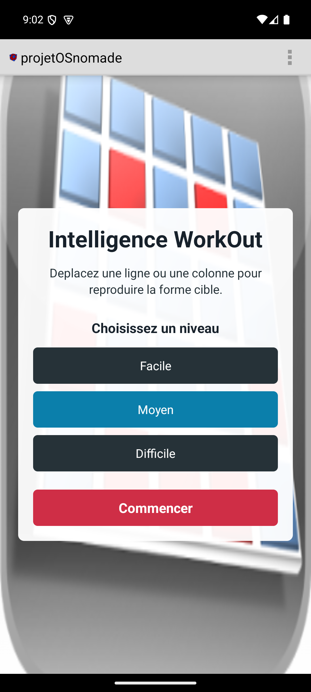
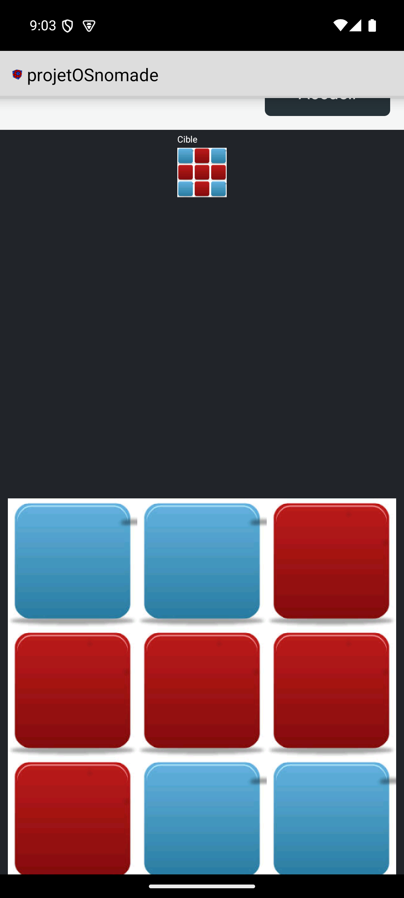
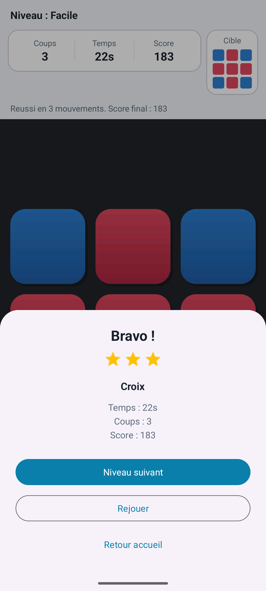

# Intelligence WorkOut

Intelligence WorkOut est un jeu Android developpe avec Android Studio. Le joueur organise des blocs dans une grille pour reproduire une forme cible en deplacant une ligne ou une colonne a la fois.

## Fonctionnalites

- Accueil plein ecran sans ActionBar.
- Interface modernisee inspiree Material Design 3 : carte centrale, coins arrondis, couleurs harmonieuses et espacements plus lisibles.
- Niveaux Facile, Moyen et Difficile.
- Score, nombre de deplacements et temps ecoule.
- Boutons Reinitialiser et Retour accueil pendant la partie.
- Ecran de victoire avec niveau joue, temps, deplacements, score final, Rejouer et Retour accueil.

## Installation

Ouvrir le projet dans Android Studio ou utiliser Gradle depuis `C:\Dev\intelligence_Workout`.

## Compilation

```powershell
.\gradlew assembleDebug
```

L'APK debug est genere dans `app/build/outputs/apk/debug/`.

## Niveaux

- Facile : petite grille, peu de deplacements necessaires.
- Moyen : grille moyenne proche de l'experience originale.
- Difficile : grande grille et formes plus complexes.

## Score

Le score baisse a chaque deplacement. Quand le joueur gagne, le score final augmente avec un bonus de victoire, un bonus selon la difficulte et un bonus si le niveau est termine avec peu de deplacements.

## Captures d'ecran







> `victory.png` est referencee pour la prochaine capture de victoire si elle n'est pas encore presente.

## Prerequis

- JDK 17
- Android SDK avec la plateforme 36 installee
- Android Gradle Plugin 8.11.1, resolu par Gradle

Pour un build local Windows, creez un fichier non versionne `local.properties` si necessaire :

```properties
sdk.dir=C\:\\Dev\\Android\\Sdk
```
