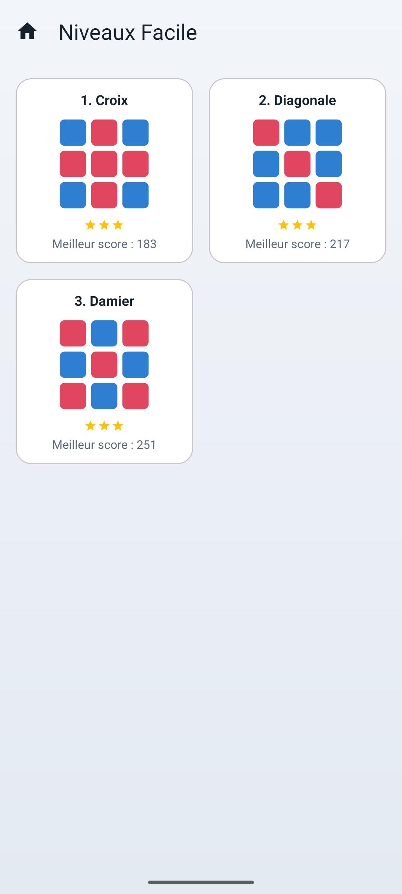

# Intelligence WorkOut

Intelligence WorkOut est un jeu Android developpe en Java (Canvas/SurfaceView, sans Compose). Le joueur fait tourner une ligne ou une colonne a la fois pour reproduire une grille cible.

## Fonctionnalites

- Theme Material 3, mode clair et sombre.
- Accueil avec un compteur d'etoiles global et une carte par palier de difficulte (Facile, Moyen, Difficile), chacune montrant les etoiles obtenues et les niveaux verrouilles.
- Ecran de selection de niveau : apercu de la grille cible, meilleur score et etoiles pour chaque niveau.
- 9 niveaux fixes et deterministes, 3 par palier, de complexite croissante (voir ci-dessous).
- Grille jouee en glisser-deposer : la ligne ou la colonne suit le doigt et s'anime jusqu'a sa position finale ; un geste = un coup, quel que soit le nombre de cellules traversees.
- Annuler (Undo), Indice (met en evidence la ligne/colonne la plus proche d'etre correcte, plafonne le niveau a 2 etoiles) et Reinitialiser.
- Retour haptique et animation de victoire (vague de tuiles + flash).
- Progression sauvegardee localement : etoiles, meilleur score/temps/coups par niveau, deverrouillage en cascade.
- La partie en cours survit a une rotation d'ecran.

## Niveaux

| Palier | Niveau | Nom | Grille |
| --- | --- | --- | --- |
| Facile | 1 | Croix | 3x3 |
| Facile | 2 | Diagonale | 3x3 |
| Facile | 3 | Damier | 3x3 |
| Moyen | 1 | Cadre | 4x4 |
| Moyen | 2 | Sablier | 5x5 |
| Moyen | 3 | Viseur | 5x5 |
| Difficile | 1 | Noeud papillon | 6x6 |
| Difficile | 2 | Spirale | 6x6 |
| Difficile | 3 | Zebre | 6x6 |

Chaque niveau est genere en appliquant un nombre fixe de rotations aleatoires (seed deterministe) a sa grille cible, ce qui garantit qu'il est toujours solvable.

## Score et etoiles

Le score part d'une valeur de depart selon la difficulte, diminue a chaque coup, puis reçoit un bonus de victoire et un bonus si le niveau est termine en peu de coups. A la victoire :

- 3 etoiles si le nombre de coups est au plus egal au nombre de coups optimal du niveau,
- 2 etoiles si ce nombre est depasse mais reste sous 1,5x l'optimal,
- 1 etoile sinon.

Utiliser l'indice plafonne le resultat a 2 etoiles.

## Installation et compilation

Ouvrir le projet dans Android Studio, ou utiliser Gradle depuis `C:\Dev\intelligence_Workout` :

```powershell
.\gradlew assembleDebug
```

L'APK debug est genere dans `app/build/outputs/apk/debug/`.

## Tests

```powershell
.\gradlew testDebugUnitTest
```

Les tests couvrent le moteur de jeu (`GameEngine` : rotations, undo, victoire, score, etoiles), le generateur de grilles (`GridScrambler` : les 9 niveaux sont solvables, deterministes, distincts de leur cible) et la progression (`ProgressStore` : deverrouillage en cascade, scores jamais decroissants).

## Captures d'ecran





## Prerequis

- JDK 17
- Android SDK avec la plateforme 36 installee
- Android Gradle Plugin 8.11.1, resolu par Gradle
- minSdk 21

Pour un build local Windows, creez un fichier non versionne `local.properties` si necessaire :

```properties
sdk.dir=C\:\\Dev\\Android\\Sdk
```
